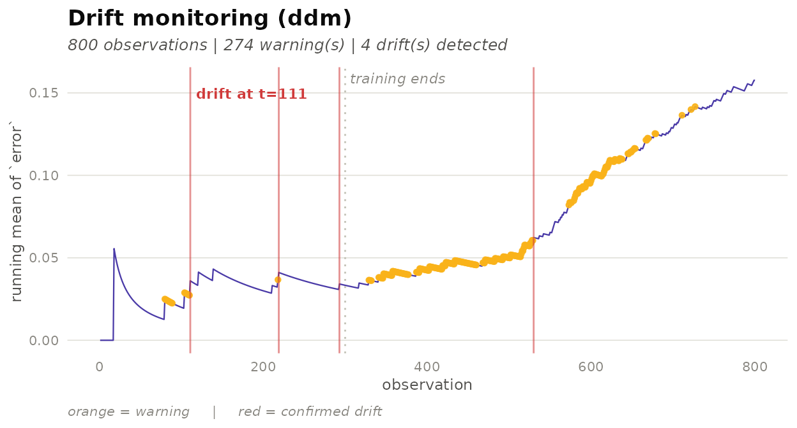

# Getting Started with deriva

``` r

library(deriva)
```

## What is concept drift?

A machine learning model trained on historical data operates under the
implicit assumption that the data-generating process remains stable over
time. When this assumption breaks down — because user behaviour shifts,
sensor calibration drifts, or the world simply changes — the model’s
predictions degrade without any obvious error being raised. This
phenomenon is called **concept drift**.

Monitoring for drift requires a *drift detector*: an algorithm that
reads a stream of per-observation signals (typically prediction errors)
and raises a flag when the signal’s distribution has changed
significantly. The `deriva` package provides a tidy interface to a
catalogue of 22 such detectors, designed to compose naturally with the
tidymodels ecosystem.

## Quick start

The one-shot shortcut
[`detect_drift()`](https://bonijoao.github.io/deriva/reference/detect_drift.md)
runs a detector over an existing column and returns the data annotated
with `.warning` and `.drift` flags.

``` r

# Simulate a stream: 500 stable observations, then 500 with higher error rate
stream <- sim_drift_stream(n_pre = 500, n_post = 500,
                           p_pre = 0.05, p_post = 0.30,
                           seed = 42)

result <- detect_drift(stream, .col = error, method = "ddm")

# Where was drift flagged?
subset(result, .drift)
#> # A tibble: 3 × 5
#>       t error drift_true .warning .drift
#>   <int> <int> <lgl>      <lgl>    <lgl> 
#> 1    49     1 FALSE      FALSE    TRUE  
#> 2   388     1 FALSE      FALSE    TRUE  
#> 3   512     1 TRUE       FALSE    TRUE
```

The detector correctly identifies the distributional change after the
known drift point (observation 500).

## The deriva interface

`deriva` follows the same three-verb pattern as tidymodels: **specify →
fit → advance**.

### 1. Specify a detector

[`drift_detector()`](https://bonijoao.github.io/deriva/reference/drift_detector.md)
creates an inert specification — no computation happens here.

``` r

spec <- drift_detector("ddm", min_instances = 30)
spec
#> Drift Detector Specification (ddm)
#>   min_instances: 30
#>   warning_level: 2
#>   out_control_level: 3
```

Pass method hyperparameters as named arguments. Unknown parameters raise
an informative error.

### 2. Fit on a baseline

[`fit()`](https://generics.r-lib.org/reference/fit.html) runs the
detector over the **baseline period** — the stable window against which
future observations are compared.

``` r

baseline <- sim_drift_stream(n_pre = 300, n_post = 0, seed = 1)

fitted <- fit(spec, baseline, signal = error)
fitted
#> Fitted Drift Detector (ddm)
#>   observations: 300 (300 baseline)
#>   warnings: 18 | drifts: 3
```

The fitted object is **immutable**: it stores the internal engine state
after processing the baseline, ready to receive new data.

### 3. Advance over new batches

[`advance()`](https://bonijoao.github.io/deriva/reference/advance.md)
feeds a new batch to the detector and returns a **new** fitted object
with the state updated and the annotated batch appended to the history.
The original object is not modified.

``` r

batch1 <- sim_drift_stream(n_pre = 200, n_post = 0,   seed = 2)
batch2 <- sim_drift_stream(n_pre = 0,   n_post = 300, p_post = 0.35, seed = 3)

fitted2 <- advance(fitted,  batch1)
fitted3 <- advance(fitted2, batch2)
fitted3
#> Fitted Drift Detector (ddm)
#>   observations: 800 (300 baseline)
#>   warnings: 274 | drifts: 4
```

Batches can be any size — including a single observation for true
streaming use.

### 4. Inspect results

**[`augment()`](https://generics.r-lib.org/reference/augment.html)**
returns the full annotated history as a tibble.

``` r

history <- augment(fitted3)
tail(history[, c("t", "error", ".phase", ".warning", ".drift")], 10)
#> # A tibble: 10 × 5
#>        t error .phase .warning .drift
#>    <int> <int> <chr>  <lgl>    <lgl> 
#>  1   291     1 stream FALSE    FALSE 
#>  2   292     0 stream FALSE    FALSE 
#>  3   293     0 stream FALSE    FALSE 
#>  4   294     0 stream FALSE    FALSE 
#>  5   295     0 stream FALSE    FALSE 
#>  6   296     0 stream FALSE    FALSE 
#>  7   297     1 stream FALSE    FALSE 
#>  8   298     1 stream FALSE    FALSE 
#>  9   299     1 stream FALSE    FALSE 
#> 10   300     0 stream FALSE    FALSE
```

**[`tidy()`](https://generics.r-lib.org/reference/tidy.html)** extracts
the detected drift points.

``` r

tidy(fitted3)
#> # A tibble: 4 × 2
#>   index phase   
#>   <int> <chr>   
#> 1   111 baseline
#> 2   219 baseline
#> 3   293 baseline
#> 4   530 stream
```

**[`glance()`](https://generics.r-lib.org/reference/glance.html)** gives
a one-row summary.

``` r

glance(fitted3)
#> # A tibble: 1 × 5
#>   method n_obs n_warning n_drift first_drift
#>   <chr>  <int>     <int>   <int>       <int>
#> 1 ddm      800       274       4         111
```

**[`autoplot()`](https://ggplot2.tidyverse.org/reference/autoplot.html)**
plots the running mean of the signal with warning (orange) and drift
(red) markers, and a dotted line separating baseline from stream.

``` r

library(ggplot2)
autoplot(fitted3)
```



## Bridging from tidymodels

In a real workflow, the signal column comes from model predictions, not
a simulation.
[`add_prediction_error()`](https://bonijoao.github.io/deriva/reference/add_prediction_error.md)
converts the output of tidymodels’
[`augment()`](https://generics.r-lib.org/reference/augment.html) (which
contains truth and estimate columns) into a `.error` column that drift
detectors can consume.

``` r

# Simulate tidymodels augment() output for a classifier
predictions <- data.frame(
  time     = 1:8,
  truth    = factor(c("yes","no","yes","yes","no","yes","no","yes")),
  .pred_class = factor(c("yes","no","yes","no" ,"no","no" ,"no","yes"))
)

add_prediction_error(predictions, truth = truth)
#> # A tibble: 8 × 4
#>    time truth .pred_class .error
#>   <int> <fct> <fct>        <int>
#> 1     1 yes   yes              0
#> 2     2 no    no               0
#> 3     3 yes   yes              0
#> 4     4 yes   no               1
#> 5     5 no    no               0
#> 6     6 yes   no               1
#> 7     7 no    no               0
#> 8     8 yes   yes              0
```

For regression problems, `.error` is the absolute prediction error; for
classification it is a 0/1 mismatch indicator.

## Distribution-based detectors

Some detectors monitor the distribution of a numeric stream directly,
without requiring labelled errors. These `signal_type = "distribution"`
methods (such as `"kswin"` and `"adwin"`) expect a continuous input
column.

``` r

cont_stream <- sim_dist_stream(
  n_pre = 500, n_post = 500,
  mean_pre = 0, mean_post = 2,
  seed = 99
)

detect_drift(cont_stream, .col = value, method = "kswin") |>
  subset(.drift) |>
  head()
#> # A tibble: 6 × 5
#>       t   value drift_true .warning .drift
#>   <int>   <dbl> <lgl>      <lgl>    <lgl> 
#> 1   222  2.03   FALSE      NA       TRUE  
#> 2   374 -1.54   FALSE      NA       TRUE  
#> 3   491  0.0701 FALSE      NA       TRUE  
#> 4   561  2.40   TRUE       NA       TRUE  
#> 5   796  2.31   TRUE       NA       TRUE  
#> 6   980  3.20   TRUE       NA       TRUE
```

## Available methods

`deriva` ships with 22 drift detectors across two signal types.

| Signal type | Methods |
|----|----|
| `"error"` (0/1 or continuous error) | `ddm`, `eddm`, `hddm_a`, `hddm_w`, `ewma`, `rddm`, `stepd`, `fhddm`, `fhddms`, `mddm_a`, `mddm_e`, `mddm_g`, `wstd`, `ftdd`, `fpdd`, `fsdd` |
| `"distribution"` (numeric stream) | `kswin`, `adwin`, `page_hinkley`, `cusum`, `seed`, `seqdrift2` |

Use `drift_detector("<method>")` to inspect default hyperparameters for
any method.

## Summary

The core `deriva` workflow is:

``` r

drift_detector("ddm") |>          # specify
  fit(baseline, signal = error) |> # learn reference level
  advance(new_batch)               # update state, persist flags
```

Supplementary verbs —
[`augment()`](https://generics.r-lib.org/reference/augment.html),
[`tidy()`](https://generics.r-lib.org/reference/tidy.html),
[`glance()`](https://generics.r-lib.org/reference/glance.html),
[`autoplot()`](https://ggplot2.tidyverse.org/reference/autoplot.html) —
follow the tidymodels convention and make it straightforward to inspect,
summarise, and plot detection results at any point in the stream.
